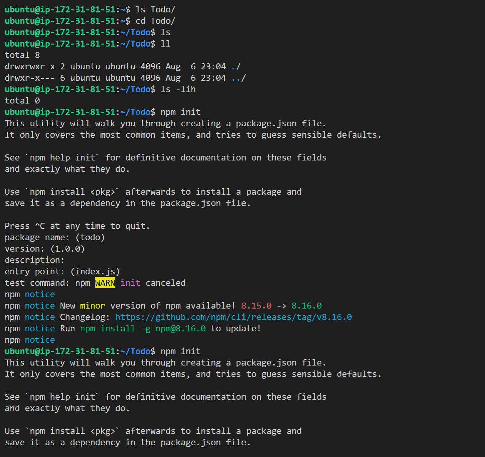

1. With this Project we will create an application but instead of LAMP or LEMP stacks we will use the MERN stack with MONGO DB being our Database, Express js as our application server, React as our Front-End/Client, and NODE.js as our runtime (express sits on top of Node.js )
2. We start by updating and upgrading our ubuntu server using cmds `sudo apt update` and `sudo apt upgrade`
3. We then find the node.js application in the ubuntu repository we can do this by using `curl -fsSL https://deb.nodesource.com/setup_18.x | sudo -E bash -` once done use command `sudo apt-get install -y nodejs` this will install node js and NPM you can they've been correctly installed by using the cmds `node -v` and `npm -v`
4. Create a new Directory named Todo using cmd `mkdir Todo` and cd into it
5. Now initialize npm using `npm init`  
6. Next install Express.js which runs on top of Node.js and is a framework to quickly build web and mobile applications, API's and hand low level functions such as HTTP and Server requests and handling. We do this by installing express.js using the cmd `npm install express`
7. create a file named index.js using the `touch` cmd and confirm using ls 